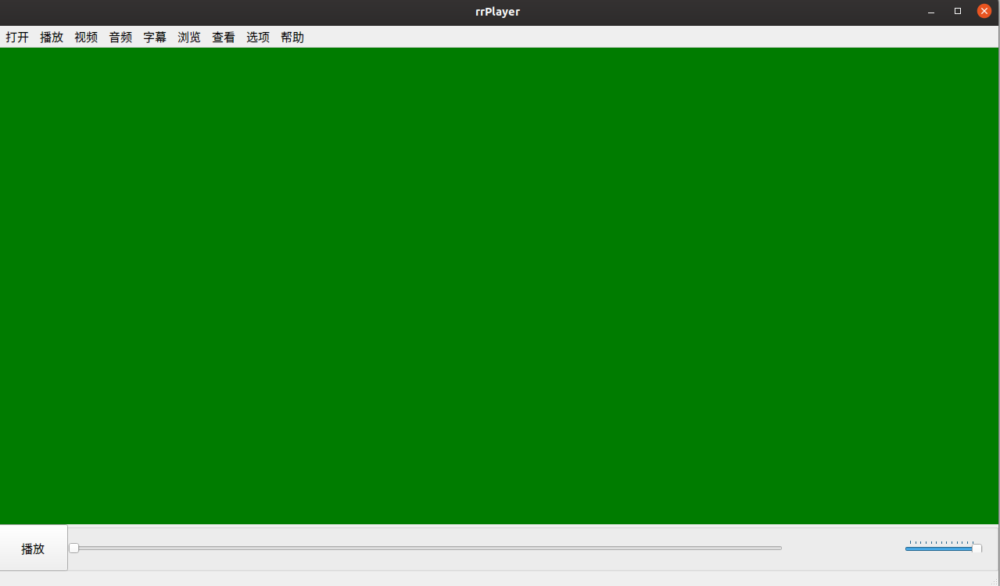

# rrPlayer
##  Base on Qt with FFmpeg and SDL2.0
- FFmpeg国内镜像源下载:https://gitee.com/rzkn/ffmpeg?_from=gitee_search
- SDL2.0下载:http://www.libsdl.org/download-2.0.php
### SDL2.0遇到错误总结
#### No such audio device
- 原因：库依赖没有安装完全
- 解决方案："sudo apt-get install libasound2-dev libpulse-dev"安装库 并且重新配置sdl库.

### 界面展示
